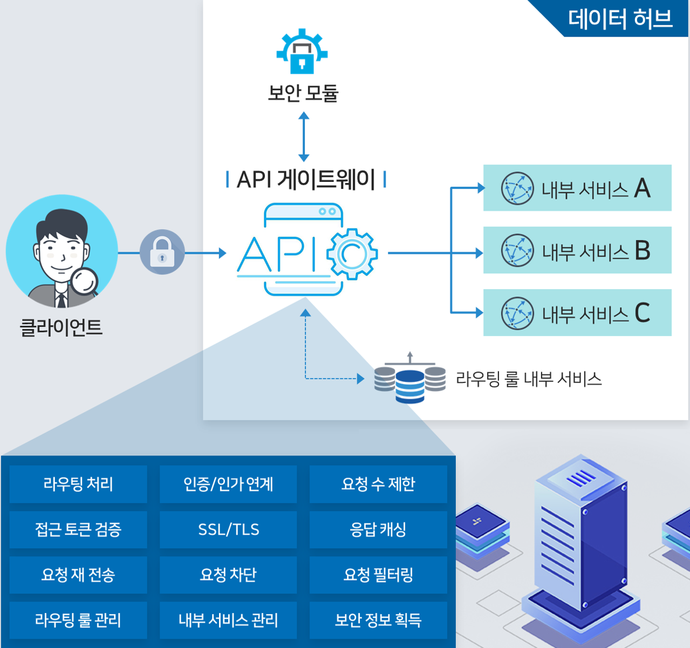

# API G/W

API 게이트웨이는 데이터 허브 외부에서의 API 접점으로써, 데이터 허브 기반 서비스, 데이터 마켓 플레이스 포털, 데이터 허브 각 모듈 별 관리자 UI에서 데이터 허브의 API를 호출할 경우 사용하게 된다.

데이터 허브 API 게이트웨이는 **Spring Cloud Gateway**를 사용하여 개발하였으며, **Spring Cloud Gateway**에서 추가 개발된 내용은 하기와 같다.

- API를 통한 API 게이트웨이 라우팅 룰 관리
- API를 통한 API 게이트웨이 데이터 허브 내부 서비스 관리
- API를 통한 API 게이트웨이 라우팅 룰 변경 사항 전파 (Eureka)
- API를 통한 API 게이트웨이 라우팅 룰 갱신
- 데이터 허브 인증/인가 모듈을 통한 접근제어 토큰 검증 RSA Public Key 획득
- 데이터 허브 접근제어 토큰 기반 토큰 유효성 검증 (적합하게 발급된 토큰 여부, 토큰 만료 여부)
- 접근 제어 토큰에 명시된 Role 기반 API 접근 여부 검증
- 외부 클라이언트에서의 요청수 제한 (클러스터 기반, 개별 인스턴스 별)

